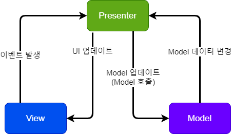
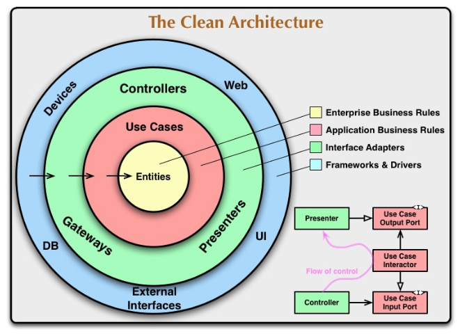

# MVC vs MVP vs MVVM

## 공통 목적

**Model 과 View 의 의존성을 분리하자!**

- Model
  - Model 에는 단위 테스트가 가능한 비즈니스 로직이 있다.
  - Model 은 프레임워크에 의존적이지 않은 순수한 언어로 구현된다.
- View
  - View 에는 Model 이 제공하는 Data 를 그려준다.
  - 사용자는 View 를 통해 상호작용할 수 있다.
  - View 가 변경된다고 Model 변경되어서는 안된다.

## MVC (Model-View-Controller)

- 초기에 유행하던 아키텍처
- Model 을 순수 자바 혹은 코틀린으로 구현
- View를 xml 로 구현
- Controller 는 안드로이드의 Activity 로 구현

### 문제점: Controller 가 엄청나게 뚱뚱해지기 시작했다.

여기서 알 수 있는 교훈: Controller 는 사실상 View 와 다를바가 없는 엔드 포인트이구나!

## MVP (Model-View-Presenter)

- Model 을 순수 자바 혹은 코틀린으로 구현
- Presenter 에게 Model과 View(=Controller)의 중간에서 View에서 전달된 이벤트에 대한 처리를 담당하게함
- Presenter는 View와 Model에 대한 참조를 가지고 있다.
- View는 최대한 아는 것이 없어야 한다.

### 문제점: Presenter 가 엄청나게 뚱뚱해지기 시작했다.

- View 와 Model 이 늘어날 수록, Presenter 가 점점 더 뚱뚱해지면서 관리가 어려워짐
- View와 Presenter 간의 의존성이 강하다.
- View와 Presenter는 1:1 관계이기 때문에 여러 Presenter에서 중복 코드가 발생할 수 있다.
- 프로그램이 조금만 복잡해져도 Presenter가 굉장히 방대해진다.

## MVVM (Model-View-ViewModel)

- [마틴 파울러의 Presentation Model](https://martinfowler.com/eaaDev/PresentationModel.html) 디자인 패턴이 원조
- 2005년에 [마이크로소프트 아키텍트인 존 구스먼(John Gossman)이 MVVM](<https://docs.microsoft.com/en-us/previous-versions/msp-n-p/hh848246(v=pandp.10)?redirectedfrom=MSDN>)을 발표
- 한글로 번역된 문서 중에서는 마이크로소프트의 [자마린 문서](https://docs.microsoft.com/ko-kr/xamarin/xamarin-forms/enterprise-application-patterns/mvvm) 가 제일 좋은 듯함

### Binder

- MVVM 의 핵심은 데이터 바인딩
- 바인더는 뷰 모델과 뷰의 동기화를 위해 상용구 로직을 작성해야 하는 의무에서 개발자를 해방시켜 준다.
- 즉 프레임워크가 뷰 모델과 뷰의 동기화를 대신 해줌
- 만약 프레임워크 없이 MVVM 을 구현하려 한다면 '선언적인 데이터 바인딩 기술' 이 있어야 이 패턴을 만들 수 있음
  - 즉 프레임워크가 없으면, 거의 프레임워크에 준하는 수준의 밑작업이 필요함
  - 마치 Spring 과 같은 DI 프레임워크 없이 어노테이션을 통한 AutoWire 를 하려는 듯한 느낌
- 따라서 프레임워크 없이 사용할 수 있는 패턴은 MVP 혹은 MVC 정도 까지가 적절하다.

### 안드로이드에서의 MVVM

- 참고로 네이티브 안드로이드에서는 원래 MVVM 을 제대로 지원하지 않았다.
- Android Architecture Components 에서 ViewModel 을 제공하기는 한데 MVVM 과 전혀 관련이 없다.
- 안드로이드 공식문서에서 전체 검색을 해봐도 MVVM 이라는 용어가 전혀 없다.
- 그렇지만 2015년도 부터 Data Binding Support 하기 시작했다고는 하지만, 아직까지 현업에서 대세 레거시는 MVP 이다.

## 결론

2주 동안 MVVM 예시 코드를 만들어보려고 노력했는데, 아직 제대로 구현을 하지 못하였다.

괜찮으면 다음 스터디 때 예시코드를 재도전을 하려고 한다.

아니면 마틴 파울러의 클린 아키텍처 자체를 도전해보려고 한다.

